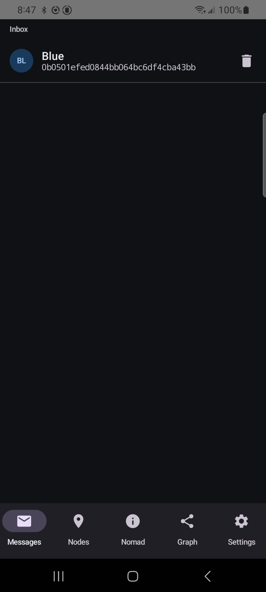
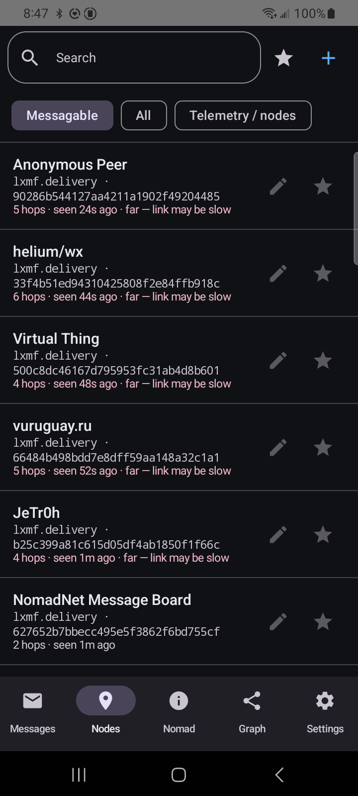
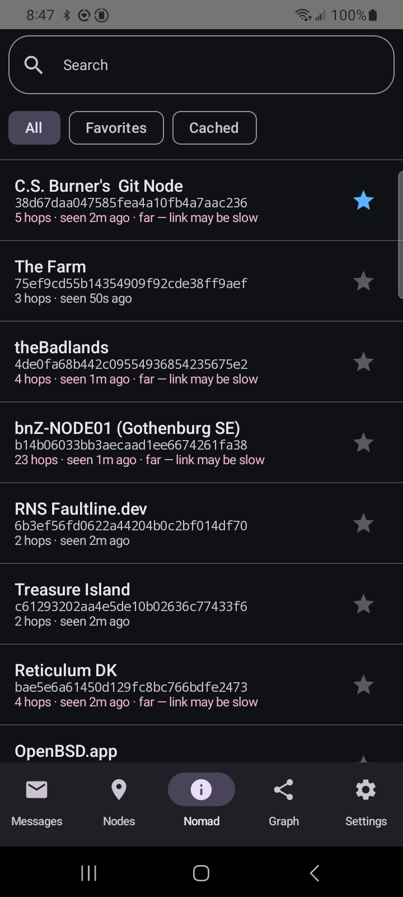
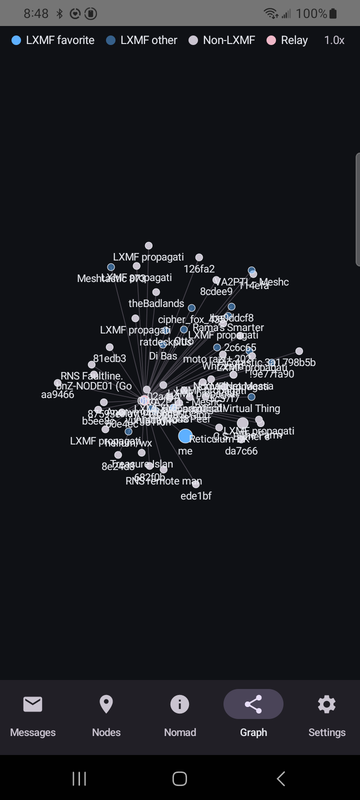
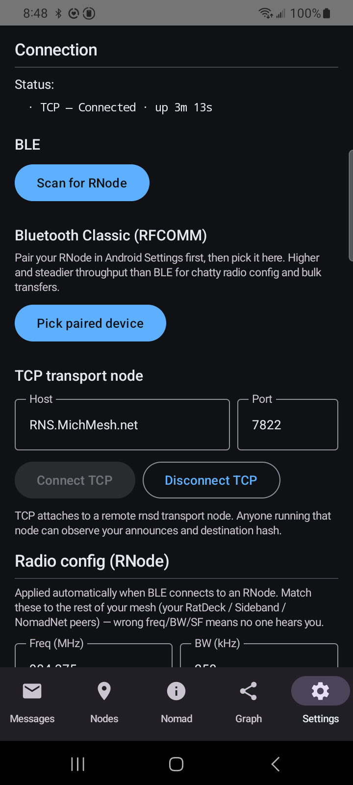

# Reticulum Mobile App

Native Android (Kotlin Multiplatform) client for the [Reticulum](https://reticulum.network/) LoRa mesh network. Replaces the [browser-based webclient](../reticulum-lora-webclient/) with a real native app that runs a foreground service for persistent BLE/TCP connections, fires system notifications on incoming LXMF messages, and ships as a signed APK.

## Status

**Alpha — signed APKs ship from CI on every `android-vX.Y.Z` tag.** Latest: [`android-v0.1.45`](https://github.com/thatSFguy/reticulum-mobile-app/releases/tag/android-v0.1.45).

Works end-to-end against a known-good Reticulum mesh:

- Connects to an RNode over BLE (with a Scan-for-RNode picker, no manual MAC entry needed)
- Pushes LoRa radio config (freq / BW / SF / CR / TX power) to the RNode on connect
- Connects to a remote rnsd `TCPServerInterface` (e.g. `RNS.MichMesh.net:7822`) or a local transport node for testing
- Receives announces, parses them, populates a unified Destinations table
- Renders a relay-aware Graph view (`me → relay → leaf`) using cached HEADER_2 transport_ids
- Renders NomadNet micron pages over Reticulum Links (single-packet + Resource-fragmented pages)
- Sends/receives opportunistic LXMF messages, including multi-hop transit via the §2.3 HEADER_2 conversion
- Generates a per-install Reticulum identity, persists it in Room
- Shares it via a QR code on the Settings tab; scans others' QR codes from the Nodes tab
- Foreground service keeps the connection alive when the Activity is gone, fires high-priority notifications on inbound messages

### Recent spec compliance fixes (v0.1.40–v0.1.45)

A multi-day chase localized a chronic "outbound to transit destinations doesn't deliver" bug to packet framing rather than crypto. The fixes are all small and spec-driven; each links to the SPEC.md section that drove the change:

- **v0.1.40** — `§2.3` originator `HEADER_1 → HEADER_2` conversion. Outbound DATA to a multi-hop destination now ships with a `transport_id` so upstream `Transport.py:1497` actually forwards it instead of silently dropping. Localized via offline replay-decrypt: our token decrypted fine, the framing was wrong.
- **v0.1.42** — `§11.1` REQUEST `path_hash` truncated to 16 bytes (was 32). NomadNet servers key `request_handlers` on `SHA256(path)[:16]`; a 32-byte hash never matches.
- **v0.1.43** — `§2.3` extended to LINKREQUEST. Same upstream rule applied to LINKREQ + PROOF, not just DATA. Without it, a LINKREQ to a multi-hop NomadNet/propagation node dies on the relay's dedup hashlist.
- **v0.1.45** — `§12.5.2` link-addressed packets need `dest_type = LINK`. After v0.1.43 the link handshake completed (LRPROOF returned) but our REQUEST and LRRTT were sent with `DEST_SINGLE`, so the relay's `link_table[link_id]` lookup never fired and the packets were dropped on the responder side.

End-to-end verified 2026-05-03 against `tools/test_lxmf_receiver.py` + `tools/test_nomadnet_node.py` behind a local `tools/test_transport_node.py`. See `todo.md` for the surviving spec-compliance gaps (initiator-side KEEPALIVE, LXMF stamps, PROOF signature verification).

## Screenshots

Live against the MichMesh TCP transport node (`RNS.MichMesh.net:7822`) on a Galaxy A42 5G. Screenshots are from v0.1.33; the relay-aware Graph and the v0.1.40+ delivery fixes have shipped since — UI shape is unchanged.

| Messages | Nodes | Nomad | Graph | Settings |
|---|---|---|---|---|
|  |  |  |  |  |

- **Messages** — favorited destinations; tap a row to open the conversation. Star a node from the Nodes tab to bring it here.
- **Nodes** — every observed `lxmf.delivery` destination with filter chips (Messagable / All / Telemetry / Favorites), search, manual hash entry, and QR scanner.
- **Nomad** — `nomadnetwork.node` destinations. Tap a node → automatically fetches `/page/index.mu` over a Reticulum Link and renders the micron content. Reload + Back affordances on the page view.
- **Graph** — Compose Canvas force-directed view (LXMF favorite / LXMF other / Non-LXMF / Relay). As of v0.1.44 each unique `nextHop` (transport_id captured from inbound HEADER_2 announces) is promoted to its own relay node; multi-hop destinations route as `me → relay → leaf` instead of the prior flat star. Pinch to zoom, drag to reposition.
- **Settings** — connection status + uptime, BLE scanner, TCP host:port, radio config (freq / BW / SF / CR / TX), identity (display name + QR), diagnostics log.

## Install

Sideload the latest signed APK:

```powershell
# Download from the releases page (latest version is in Status above)
gh release download android-v0.1.45 --repo thatSFguy/reticulum-mobile-app
adb install androidApp-release.apk
```

Or browse releases at https://github.com/thatSFguy/reticulum-mobile-app/releases and tap the `.apk` from the phone.

## What's here

| Path | Description |
|------|-------------|
| `androidApp/` | Android application: Compose UI, foreground service, Room storage, BLE transport |
| `androidApp/branding/` | Source SVG + 1024px PNG of the launcher icon (regenerable mipmaps under `res/`) |
| `shared/commonMain/` | KMP shared module: protocol, crypto interfaces, announce/LXMF/Link, telemetry parser, NomadNet micron parser |
| `shared/androidMain/` | Android crypto provider (Bouncy Castle), BLE NUS transport, TCP socket actual |
| `shared/iosMain/` | iOS scaffold (commented out — future) |
| `reference/` | JS source files from the webclient, protocol notes, test vectors |
| `.github/workflows/` | `android-ci.yml` builds debug APK on every push; `android-release.yml` builds signed AAB+APK on tag |
| `CLAUDE.md` | Project guide: architecture, protocol reference, known bugs, running diagnostics |

## Architecture

```
shared/commonMain/     ← Protocol logic (platform-independent)
  ├── protocol/        Packet header encode/decode, constants
  ├── crypto/          Identity, TokenCrypto, CryptoProvider interface
  ├── codec/           Minimal MessagePack encoder/decoder
  ├── announce/        Build/parse/validate announces, known destinations, telemetry parser
  ├── lxmf/            LXMF message pack/unpack with dual-variant signature verify
  ├── link/            Reticulum Link protocol (responder + initiator state machines)
  ├── nomad/           Micron parser for NomadNet pages
  ├── resource/        Reticulum Resource fragmentation (multi-packet pages, propagation /get)
  ├── engine/          ReticulumEngine glue: routes packets, manages link sessions, primePath helper
  ├── transport/       KISS + HDLC frame encode/decode, Transport interface, TcpInterface
  └── store/           Data models + repository interfaces (single Destinations table; nextHop captured for the relay-aware Graph)

shared/androidMain/    ← Android-specific
  └── platform/        AndroidCryptoProvider (Bouncy Castle / JCA), BleTransport (NUS), RadioConfig

androidApp/            ← Android UI + lifecycle
  ├── ui/screens/      Messages, Nodes, Nomad, Graph, Settings (5 bottom-nav tabs)
  ├── ui/graph/        Force-directed layout for the Graph tab
  ├── service/         ReticulumService: foreground service + reconnect supervisor
  ├── storage/         Room database + Repositories implementing the commonMain interfaces
  ├── platform/        BLE permission helper, BLE scanner, QR code generator
  └── MainActivity.kt  Entry point + nav host
```

## Tabs

- **Messages** — favorited destinations with a conversation view; star a destination on Nodes to bring it here.
- **Nodes** — every observed destination with filter chips (Messagable / All / Telemetry / Favorites). Manual hash entry + QR scanner. "Last seen" age + stale warning for destinations that haven't announced in 30 min.
- **Nomad** — listing of `nomadnetwork.node` destinations. Tap a node → fetches `/page/index.mu` automatically over a Reticulum Link and renders the micron content. Single-packet pages and multi-packet pages assembled via the Resource protocol are both supported.
- **Graph** — Compose Canvas force-directed view of all destinations + relays (`me → relay → leaf` via cached HEADER_2 transport_ids); pinch zoom, two-finger pan, drag-to-reposition.
- **Settings** — connection (BLE scanner / TCP host:port), radio config (freq/BW/SF/CR/TX power), identity (display name editor, QR code, reset), diagnostics log with copy/clear.

## Build

CI handles releases. To build locally:

```bash
# Install JDK 17 (e.g. Microsoft.OpenJDK.17 via winget on Windows)
gradle wrapper --gradle-version 8.7   # one-time wrapper bootstrap
./gradlew :androidApp:assembleDebug
```

Output APK lands at `androidApp/build/outputs/apk/debug/`.

For signed releases, set the four `ANDROID_KEYSTORE_*` GitHub Actions secrets (or env vars locally) and tag `android-vX.Y.Z`.

## Related

- [reticulum-lora-webclient](../reticulum-lora-webclient/) — the Capacitor-based browser client this replaces
- [reticulum-rnode](../reticulum-rnode/) — RNode firmware (the LoRa modem)
- [reticulum-lora-repeater](../reticulum-lora-repeater/) — repeater firmware
- [markqvist/Reticulum](https://github.com/markqvist/Reticulum) — upstream Python RNS
- [torlando-tech/columba](https://github.com/torlando-tech/columba) — another native Android Reticulum client (independent codebase, same target)
- [liamcottle/reticulum-meshchat](https://github.com/liamcottle/reticulum-meshchat) — Reticulum chat with Android builds
