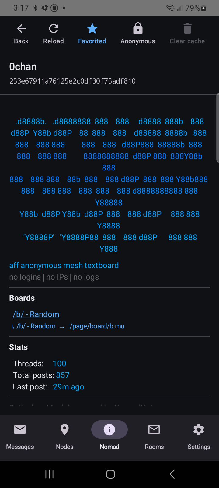
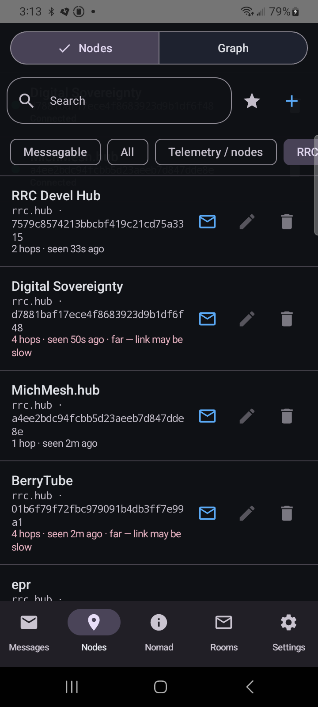
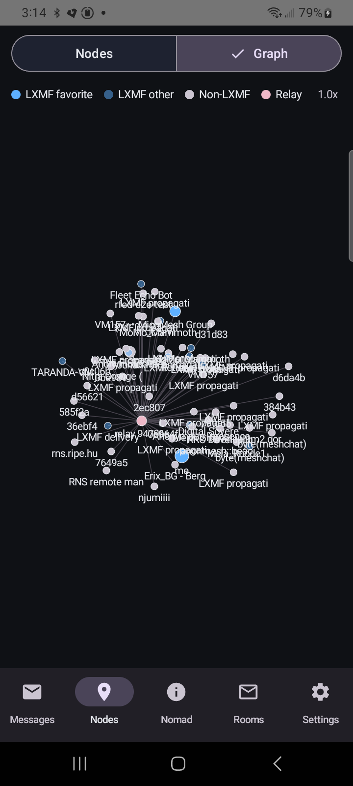
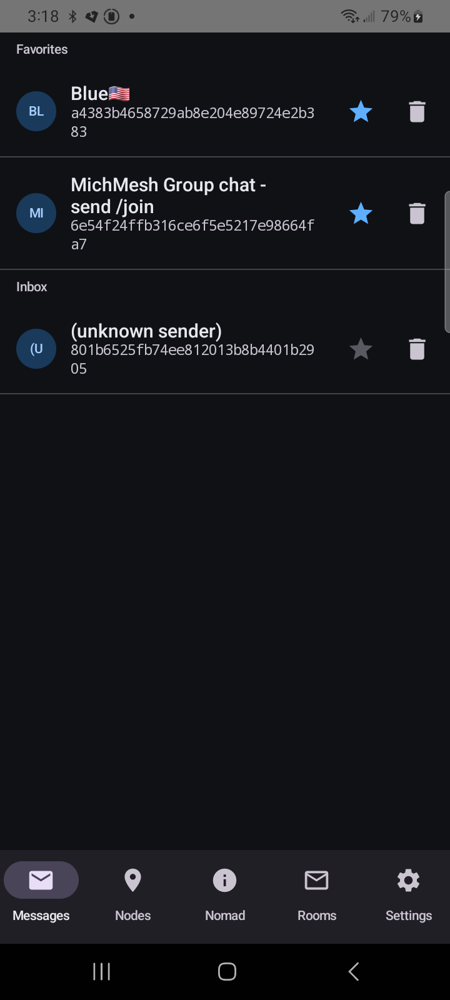
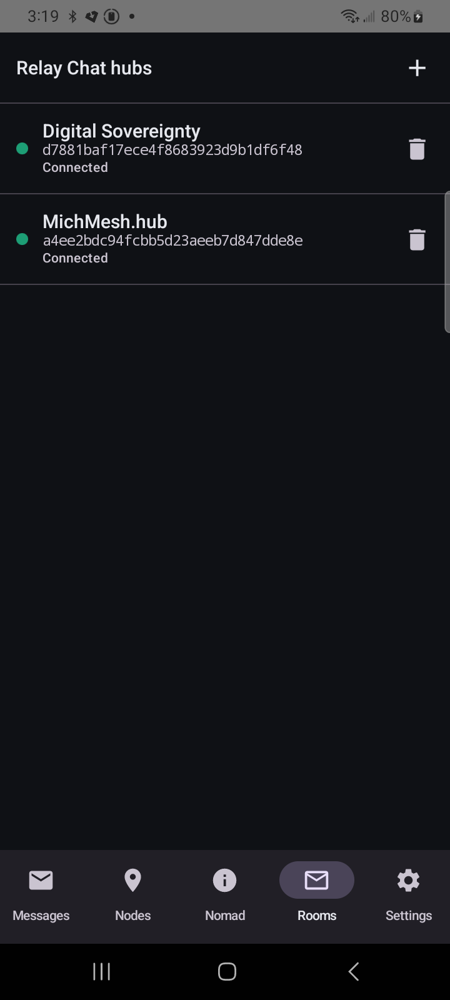
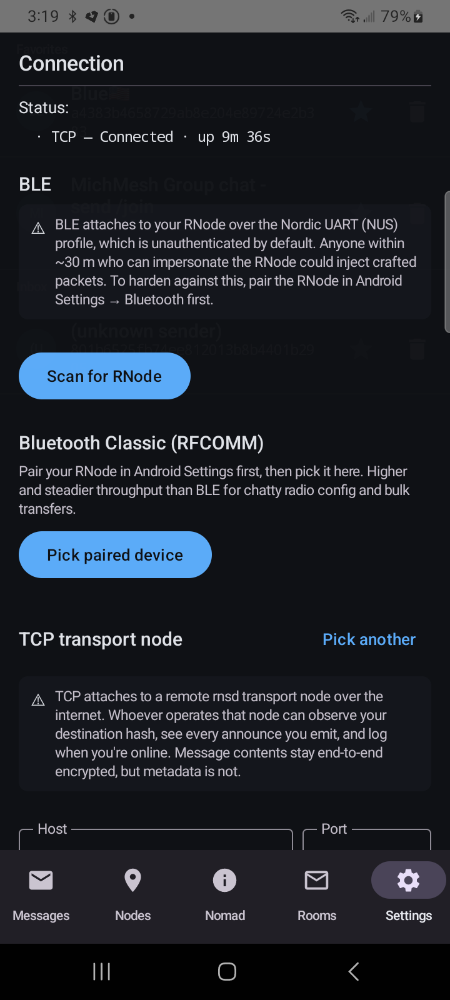
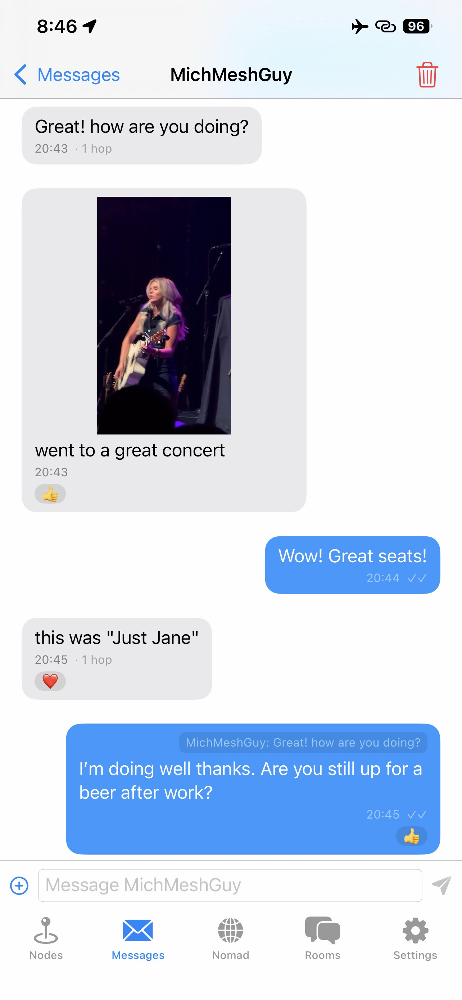

# Reticulum Mobile App

*Off-grid encrypted messaging for Android & iOS — over LoRa radio or the open internet, with no servers, no accounts, and no app-store lock-in.*

Native Android & iOS client for the [Reticulum](https://reticulum.network/) mesh network, built in Kotlin Multiplatform. A real native app — foreground service for persistent background connections, system notifications on incoming LXMF — replacing the [browser-based webclient](https://github.com/thatSFguy/reticulum-lora-webclient).

**No external dependencies.** No accounts, no API keys, no central server, no analytics, no Google Play Services, no Firebase. Identity generated on-device, all crypto runs locally, persistence is Room (SQLite). The only outbound traffic is whatever transport you attach (BLE / Bluetooth Classic to your own RNode, or TCP to an `rnsd` you pick — including `127.0.0.1` for offline LAN testing). The Android app makes **no HTTP requests at all** — no map tiles, no analytics, no update checks; the only outbound bytes are Reticulum packets over the transport you attach.

## Status

**v1.0 — feature-complete for the v1 scope. Signed APKs and unsigned IPAs ship from CI on every tag.**
[](https://github.com/thatSFguy/reticulum-mobile-app/releases/latest)
[](LICENSE)
[](#platform-parity)

The protocol implementation has been verified end-to-end against live `tools/test_lxmf_receiver.py` + `tools/test_nomadnet_node.py` runs and MichMesh nodes, audited for security (2026-05-07 review on the full 73-commit window since the last webclient audit), and the version pipeline derives `versionName` / `versionCode` directly from the git tag so what you install matches what the release page advertises.

## Project scope — personal app, shared in the open

This is a **personal app, released in the open**. It does what I need an off-grid Reticulum client to do, it's complete for that scope, and it is deliberately **closed to new feature requests**. The goal is the opposite of feature growth: the smallest, most static attack surface I can keep secure and reason about. You are very welcome to:

- **Use it** — install the signed APK, attach your own RNode (BLE / USB / Bluetooth Classic) or a TCP node, and message people. No account, no server, no telemetry.
- **Fork it** — it's [AGPL-3.0](LICENSE). Build your own version with whatever features you want; that's what the licence is for.
- **Report security issues** — see **[SECURITY.md](SECURITY.md)**. Vulnerability reports are the one kind of report I actively want.
- **Report bugs** in the *existing* feature set — a focused bug report is welcome.

What I'm **not** taking: feature requests, "please add X" issues, or feature PRs — they'll be closed unmerged. Not because they're bad ideas, but because every added surface works against the security goal. Fork away instead. See [CONTRIBUTING.md](CONTRIBUTING.md) for the full policy.

## Capabilities

**Transports** — BLE NUS, Bluetooth Classic / RFCOMM (SPP), direct TCP to a remote rnsd `TCPServerInterface`, and **USB serial** (experimental — wired RNode over USB-OTG, CDC-ACM / CP210x chips; needs on-device verification). Any combination simultaneously, with independent reconnect supervisors per kind. Per-link traffic pins to the kind that established the link; outbound LXMF + initiator LINKREQUEST to a known peer routes via hop-count-aware per-destination affinity (sticky on the shortest path so a TCP-attached mesh's re-emit of a peer's own LoRa announce can't hijack a working direct route). Only announces and path requests fan out to every attached transport. Inbound dedup is global. LoRa radio config (freq / BW / SF / CR / TX power) pushed to every attached RNode on connect, re-pushable from Settings. Connecting is a single transport-agnostic **"Add node"** scan — the app auto-detects whether a device speaks BLE NUS or Bluetooth-Classic SPP (no manual choice) and routes accordingly. Nodes you connect to are kept in a **Saved nodes** list (tap to switch between RNodes / TCP without re-scanning, swipe to forget), the status line names the connected node, and reconnect is **event-driven** — the app reconnects the instant a dropped RNode re-advertises rather than waiting out a fixed backoff. Each transport has an independent **enable toggle** (Settings → Connection → Transports) — a disabled transport is never started, so it never scans, connects, or feeds bytes to a parser. Turn off the ones you don't use to shrink the runtime attack surface to only the paths you actually rely on.

**LXMF messaging** — Sideband-parity link delivery as the primary outbound path (encrypted single-link DATA + per-packet PROOF awaits), with up to 5 link-establishment attempts at 10s intervals (matching LXMF's `MAX_DELIVERY_ATTEMPTS` / `DELIVERY_RETRY_WAIT`) so a single LoRa half-duplex collision on the LINKREQUEST or LRPROOF doesn't kill the whole send. Opportunistic single-packet fallback only after the full retry budget is exhausted. Multi-hop transit via §2.3 HEADER_2 conversion. Per-packet PROOF receipts on inbound link DATA, **with full Ed25519 signature verification against the responder's long-term key per spec §6.5.1** (closed a silent-message-loss vector found in the v1 security review). The Messages tab is a single recency-sorted conversation list — pin conversations to the top, search by name or hash, **unread-count badge per thread** that clears the moment you open the conversation. A shared destination detail sheet (tap a node on the Nodes tab, or long-press a conversation) carries the full destination hash, a QR code, and the message / pin / add-to-contacts / rename / delete actions. Image attachments (JPEG auto-compressed through a quality ladder to fit the Resource wire budget, EXIF-orientation-corrected so portrait and landscape shots display upright; tap an image to open it full-screen at the largest size the screen allows for its aspect ratio). Signal-style tap-back emoji reactions and swipe-right-to-reply quoting; long-press any message for **delete** (local-only) and a **message info** sheet (timestamp, delivery state, RSSI / hops, message + packet IDs). Unsent **draft text is retained per conversation** across leaving the thread, switching tabs, and backgrounding, and the system back gesture returns to the conversation list rather than closing the app. LXMF propagation node sync (`/offer` + `/get` with the §2.3 fix and §11.1 16-byte path_hash).

**NomadNet browser** — micron parser at upstream `MicronParser.py` parity (backtick escapes, tables, page-level `#!c=` / `#!bg=` / `#!fg=` headers, partials / server-side includes). Single-packet and Resource-fragmented pages. Form inputs (text / checkbox / radio) submit as `field_<name>` keys per `Node.py`. In-page link navigation (same-node + cross-node), history-aware Back, link reuse across page nav, opt-in `LINKIDENTIFY` for ALLOW_LIST pages. Page cache with "last pulled Xm ago", reload, clear. Search box + Favorites + Cached chips. Selectable text + LXMF link targets directly from rendered pages.

**Reticulum Relay Chat (experimental)** — opt-in IRC-style group chat layered on RNS Links — the [RRC protocol](https://rrc.kc1awv.net/), CBOR envelopes exchanged over an identified Link to a hub. Enable it in Settings to get a **Rooms** tab: add a hub by its destination hash, or one-tap-promote a discovered `rrc.hub` straight from the Nodes list (RRC hubs are recognized and labelled there), then connect, join rooms, and chat. Hub / room / message history persists in its own `rrc_*` tables. **Off by default and still under development** — not yet interop-verified against a live hub; ordinary LXMF messaging is unaffected whether it's on or off.

**Identity & contacts** — per-install Reticulum identity (X25519 + Ed25519, ratchet, persisted in Room / SQLDelight). QR card on Settings to share, scan others' from Nodes. **Identity export / import via passphrase-encrypted `.rmid` archives** (PBKDF2-HMAC-SHA256 → HKDF-split → AES-256-CBC + HMAC-SHA256, encrypt-then-MAC) — back up before reinstalling, migrate to a new phone, recover from device loss. Saves through the Android share sheet, imports through the file picker. Wrong passphrase / tampered bytes are indistinguishable on the wire by design. Local-only nicknames per contact (`userLabel`, never sent on the wire) win over the announced display name everywhere; set or clear one from a destination's detail sheet. Manual hash entry + QR scanner for adding contacts before they announce.

**Visibility** — relay-aware Graph (`me → relay → leaf` via cached HEADER_2 transport_ids), per-row metadata (hop count, RSSI, last-heard age, stale/far warnings), per-message link-quality footers (RSSI + hop count on each incoming bubble), diagnostics log with copy/clear. Bottom-nav Settings icon turns red when no transport is connected. Notifications surface incoming messages while backgrounded; tap an incoming notification to open the matching conversation.

**Spec compliance & hardening** — §2.3 originator HEADER_1→HEADER_2 conversion (DATA + LINKREQ), §11.1 16-byte request_path_hash, §11.2 request_id verification, §6.5 link-addressed `dest_type = LINK`, §6.5.1 Ed25519-verified link DATA proofs, §6.7.1 Token-encrypted KEEPALIVE bodies, §6.7.3 LINKCLOSE body verification, §10.2 / §10.5 Resource framing + RESOURCE_REQ, validateAnnounce recomputes `SHA256(name_hash ‖ identity_hash)[:16]` to reject impersonation announces, Resource size + bz2 decompression-bomb caps. Surviving gaps: initiator-side KEEPALIVE, LXMF stamps.

### Platform parity

The protocol stack is identical (commonMain Kotlin), so every wire-format / crypto / spec-compliance feature lands on both apps at the same time. Differences are confined to transport availability and a couple of platform-architectural items.

| Feature | Android | iOS | Notes |
|---|---|---|---|
| BLE (NUS) transport to RNode | ✅ | ✅ | |
| Bluetooth Classic / RFCOMM transport | ✅ | ❌ | iOS BT Classic to non-MFi peripherals requires Apple's MFi cert, closed program |
| Direct TCP to rnsd | ✅ | ✅ | |
| Multi-transport simultaneously | ✅ | ✅ | Per-link affinity, per-kind reconnect supervisors |
| Unified "Add node" picker + transport auto-detect | ✅ | ✅ | iOS is BLE + TCP only (no BT Classic), so nothing to auto-detect there |
| Saved-node list (tap to switch / swipe to forget) | ✅ | ✅ | Persists nodes you've connected to; named connected-node status line |
| Event-driven reconnect | ✅ | ✅ | Android: BLE advert scan / ACL broadcast; iOS: CoreBluetooth state-restoration + NWPathMonitor |
| LXMF send (link-delivered + opportunistic fallback) | ✅ | ✅ | Sideband-parity 5× retry @ 10 s |
| LXMF receive + delivery proofs | ✅ | ✅ | Ed25519-verified per spec §6.5.1 |
| LXMF propagation node sync | ✅ | ✅ | |
| NomadNet browser — micron rendering | ✅ rich | ✅ rich | Headings, paragraphs, tables, partials, color/bg, alignment |
| NomadNet form inputs (text / checkbox / radio) | ✅ | ✅ | `field_<name>` submit per `Node.py` |
| LINKIDENTIFY toggle for ALLOW_LIST pages | ✅ | ✅ | |
| Page cache + reload + clear | ✅ | ✅ | |
| Identity (X25519 + Ed25519 + ratchet) | ✅ | ✅ | Generated on-device |
| Display name editor (Settings) | ✅ | ✅ | Triggers immediate re-announce on save |
| Identity QR card + scanner | ✅ | ✅ | Wire-compatible QR cards across platforms |
| Manual hash entry | ✅ | ✅ | |
| Identity export / import (passphrase `.rmid`) | ✅ | ✅ | Wire-compatible `.rmid` cross-platform |
| Reset identity | ✅ | ✅ | |
| Per-contact local nickname (userLabel) | ✅ | ✅ | |
| Favorites + inbox surfaces | ✅ | ✅ | Star-toggle from Nodes / Messages / Nomad |
| Tap-to-message from Nodes | ✅ | ✅ | |
| LXMF image attachments (send / receive / full-screen view) | ✅ | ✅ | "+" button image picker with Small / Medium / Large / Original tiers on both; large images stored off-row via the [AttachmentStore](docs/ATTACHMENT-STORE.md) |
| LXMF file attachments (any MIME type) | ✅ | ✅ | "+" button file picker; off-row store on both platforms; tap-to-save via SAF (Android) / UIDocumentPicker (iOS) |
| Tap-back emoji reactions + swipe-to-reply | ✅ | ✅ | Field-16 wire-compatible with Sideband / Columba |
| Delete message + message info (long-press) | ✅ | ✅ | Local-only delete + metadata sheet (time, state, RSSI/hops, IDs) on both |
| Per-conversation draft retention | ✅ | ✅ | Unsent text kept per conversation across nav / tab switch / backgrounding |
| Per-thread unread-count badge | ✅ | ✅ | Count on each thread row, clears on open |
| Reticulum Relay Chat (RRC) rooms | ✅ experimental | ✅ experimental | Off by default behind the `experimentalRrc` flag on both; SwiftUI Rooms tab with per-room chat, room browse, /list, /topic, Rejoin escape hatch |
| Per-message link-quality footer (RSSI / hops) | ✅ | ✅ | |
| Force-directed Graph view | ✅ | ✅ | Pan/zoom on iOS, same legend |
| Nodes map (lat/lon destinations) | ❌ removed | ✅ MapKit | Android map dropped — osmdroid + OSM tile fetch removed so the app stays fully off-grid (no HTTP fetches); iOS retains a MapKit pane |
| RNode radio config form (freq / BW / SF / CR / TX) | ✅ | ✅ | Pushed on connect + on Save |
| TCP transport-node rotation ("Pick another") | ✅ | ✅ | `KnownTcpNodes` is in commonMain; both apps seed first launch from a random pick and offer a Pick-another shuffle in Settings |
| Theme picker (System / Light / Dark) | ✅ | ✅ | Settings → Appearance on both |
| Network-aware reconnect (NWPathMonitor / connectivity supervisor) | ✅ | ✅ | iOS uses `NWPathMonitor` to gate cold-start TCP reconnect and tear down the socket on involuntary network loss; Android uses its connectivity supervisor |
| Diagnostics log (copy / clear / verbose toggle) | ✅ | ✅ | |
| Notification on incoming message | ✅ | ✅ | Tap routes into the matching conversation on both platforms, including from a cold launch (Android via a `Channel`-backed pending-deep-link queue, iOS via `pendingDeepLink` drain on store init). Both also show an unread-count badge on each thread row that clears when you open the conversation. |
| Persistent background mesh listening | ✅ foreground service | ⏳ TestFlight-only | The `CBCentralManagerOptionRestoreIdentifierKey` path crashes free-dev-signed AltStore-resigned builds at launch (entitlement mismatch — found in v1.0.8 → reverted in v1.0.11). Code wiring stays in place; the option key will be re-enabled when this app ships through TestFlight / App Store with a paid Developer Program signing identity |
| Signed release artifact | ✅ APK | unsigned IPA | Sideload via AltStore / Sideloadly with a free Apple ID |

## Security model & known limitations

A full audit landed 2026-05-13; this section summarizes its findings. **Zero CRITICAL issues. Every HIGH-priority finding is shipped on Android** as of v1.1.27 — auto-backup carve-out, lockscreen-notification privacy, passphrase-strength gate on `.rmid` export, and Android Keystore-wrapping of the identity private keys. The MEDIUM and LOW findings are also closed except for one explicitly-tracked iOS follow-up (Secure-Enclave-backed identity vault) which is on-disk-format-compatible with the Android implementation and will land in a subsequent release.

This section spells out what's protected, what's not, and the one outstanding iOS hardening item so users can factor it into their own threat model.

### Wire / over-the-air

- **LXMF message bodies** are end-to-end encrypted between sender and recipient identities using Reticulum's Token construction (X25519 ECDH + HKDF-SHA256 + AES-256-CBC + HMAC-SHA256, encrypt-then-MAC, HMAC verified before decrypt). Transport-node operators, RNode firmware, BLE eavesdroppers within range, and TCP middleboxes cannot read message contents.
- **Reticulum Link sessions** use per-session ephemeral keys + LRPROOF Ed25519 signature verification before activation; per-packet PROOFs verify Ed25519 against the responder's long-term key (spec §6.5.1). Inbound LXMF signatures are verified against the sender's announced identity using the dual-msgpack-variant tolerance from §5.6.
- **Metadata is NOT encrypted.** Destination hashes, announces, hop counts, and traffic timing are visible to any attached transport node and to anyone within radio range. The TCP transport section in Settings now spells this out explicitly before the user picks a node. The mesh is gossip-based by design; operators of a transport node you attach to can observe your destination hash, every announce you emit, and when you're online.
- **Inbound LXMF whose signature can't be verified yet** (sender's announce hasn't arrived) is shown with an amber "Unverified sender" bubble and re-verified retroactively once the announce lands. If you prefer to drop unverified messages entirely, toggle "Drop unverified messages" in Settings → Privacy & security.

### At rest (on the phone)

- **Identity private keys** (X25519 + Ed25519 + ratchet) on Android (v1.1.27+) are wrapped at rest with an Android Keystore-backed AES-256-GCM key — the database holds sealed ciphertext, not the raw bytes. See the dedicated [Identity key protection at rest](#identity-key-protection-at-rest) subsection below for what this does and doesn't protect against. On iOS the keys are still stored without per-app encryption (Secure Enclave vault is the next-session follow-up).
- **Android Auto Backup is disabled** (`android:allowBackup="false"`). The identity DB does NOT flow through `adb backup`, Google Drive auto-backup, or seamless transfer to a new device. If you want a backup, use Settings → Export Identity, which produces a passphrase-encrypted `.rmid` file via PBKDF2-HMAC-SHA256 (600k iterations) + AES-256-CBC + HMAC. Export passphrases are gated by a strength meter — ≥12 chars with mixed character classes, or ≥20 chars of any kind. The crypto is solid, but anyone who has the `.rmid` file *and* the passphrase becomes you on the mesh forever, so pick accordingly.
- **iOS file protection** is currently the SQLDelight default (`NSFileProtectionCompleteUntilFirstUserAuthentication`); a future tightening pass will move the DB to `NSFileProtectionComplete`. On Android, file-based encryption (FBE) under the device PIN/biometric protects the DB on a locked device.
- **Notifications hide message previews on the lockscreen by default** (`setVisibility(VISIBILITY_PRIVATE)` + `setPublicVersion`); only "New message" / "Unverified message" surfaces until the device is unlocked.

### Identity key protection at rest

**Android** (v1.1.27+): the three identity private keys (X25519 encryption, Ed25519 signing, ratchet) are wrapped with an Android Keystore-backed AES-256-GCM key. The wrapping key sits in the device's TEE (or StrongBox where available — Pixel 3+, recent Galaxy flagships, etc.) and **cannot be cloned to another device**. `setUnlockedDeviceRequired(true)` (API 28+) means a locked phone in a forensic kit can't decrypt the rows. The DB still holds the *sealed* BLOBs in app-private storage; an attacker who pulls the DB file off a stolen unlocked-or-rooted device gets ciphertext, not key bytes.

What remains exposed:

- **Active malware on an unlocked or rooted device**: can call the Keystore as the app's UID while the device is unlocked. Mitigated but not eliminated — the wrapping key is still in the TEE, so a clone-to-another-device attack fails, but in-process exfiltration via root + an active malicious process is still possible.
- **Biometric enrollment changes / Keystore reset / device wipe**: invalidate the wrapping key. The app surfaces a clear error on next launch ("identity unrecoverable from this vault — re-import a `.rmid` backup or accept a new identity") rather than silently regenerating.

**iOS** (current): uses a pass-through `PlaintextIdentityVault`. The SQLDelight default file-protection class (`NSFileProtectionCompleteUntilFirstUserAuthentication`) provides at-rest encryption with the device passcode, but no per-app key isolation. The Secure Enclave-backed iOS vault is the next-session follow-up; the wire format is identical so existing rows migrate cleanly when iOS gains its real vault.

**Impact if keys do leak** is catastrophic and permanent: an attacker with your identity private keys can forge announces and LXMF messages indistinguishable from yours, and can decrypt every prior opportunistic-mode message you received. RNS identities don't rotate automatically.

**Recommendations**:
- Use a strong device PIN/passphrase + biometric. The Android Keystore key is bound to device-unlocked state, so this is your primary protection.
- Don't run the app on rooted/jailbroken devices unless you understand and accept the in-process malware risk.
- Keep `.rmid` exports in a password manager or encrypted vault, not in plaintext cloud storage.
- iOS users with a targeted-threat model should wait for the Secure-Enclave follow-up before relying on this app for sensitive comms — it's the one outstanding iOS hardening item from the audit.

### Reporting issues

Security issues — file a GitHub issue marked `security` or, for sensitive disclosure, email the maintainer directly (see commit history for current contact). The audit findings are summarized in the **Security model & known limitations** section above and kept public so the threat surface stays visible.

## Screenshots

### Android

Captured live on the public Reticulum mesh.

<p align="center"></p>

| Nomad browser | Nodes | Graph | Messages | Rooms | Settings |
|---|---|---|---|---|---|
|  |  |  |  |  |  |

Detail views — long-press / overflow menus / slide-up sheets:

| Conversation | Tap-back menu | Add destination | Filter menu | Detail sheet |
|---|---|---|---|---|
|  |  |  |  |  |

### iOS

| Messages | Nomad | Graph |
|---|---|---|
|  |  |  |

## Install

Sideload the latest signed APK from the Releases page (filenames now embed the version, e.g. `Reticulum-Android-1.1.4-release.apk`, so testers' Downloads folders stay disambiguated across tags):

- **Latest release page:** https://github.com/thatSFguy/reticulum-mobile-app/releases/latest

Via `gh` CLI (auto-resolves to the version-suffixed APK on the latest release):

```powershell
gh release download --repo thatSFguy/reticulum-mobile-app --pattern '*.apk'
adb install Reticulum-Android-*-release.apk
```

### Install via Obtainium (recommended for ongoing updates)

<a href='obtainium://app/{"id":"io.github.thatsfguy.reticulum.native","url":"https://github.com/thatSFguy/reticulum-mobile-app","author":"thatSFguy","name":"Reticulum","preferredApkIndex":0,"additionalSettings":"{\"includePrereleases\":false,\"fallbackToOlderReleases\":true,\"filterReleaseTitlesByRegEx\":\"\",\"filterReleaseNotesByRegEx\":\"\",\"verifyLatestTag\":false,\"dontSortReleasesList\":false,\"useLatestAssetDateAsReleaseDate\":false,\"trackOnly\":false,\"versionExtractionRegEx\":\"\",\"matchGroupToUse\":\"\",\"versionDetection\":true,\"releaseDateAsVersion\":false,\"useVersionCodeAsOSVersion\":false,\"apkFilterRegEx\":\"Reticulum-Android-.*-release\\\\.apk\\\$\",\"invertAPKFilter\":false,\"autoApkFilterByArch\":true,\"appName\":\"Reticulum\",\"shizukuPretendToBeGooglePlay\":false,\"allowInsecure\":false,\"exemptFromBackgroundUpdates\":false,\"skipUpdateNotifications\":false,\"about\":\"\"}"}'>
  
</a>

[Obtainium](https://obtainium.imranr.dev/) is an open-source Android app that pulls APKs directly from GitHub releases and notifies you of updates, without going through Google Play. iOS releases on this repo are marked as **pre-release** so Obtainium ignores them by default — no extra configuration needed.

**One-tap setup:** tap the **Get it on Obtainium** badge above on a device that already has Obtainium installed and accept the import sheet. Or open the raw deep link:

```
obtainium://app/{"id":"io.github.thatsfguy.reticulum.native","url":"https://github.com/thatSFguy/reticulum-mobile-app","author":"thatSFguy","name":"Reticulum","preferredApkIndex":0,"additionalSettings":"{\"includePrereleases\":false,\"fallbackToOlderReleases\":true,\"filterReleaseTitlesByRegEx\":\"\",\"filterReleaseNotesByRegEx\":\"\",\"verifyLatestTag\":false,\"dontSortReleasesList\":false,\"useLatestAssetDateAsReleaseDate\":false,\"trackOnly\":false,\"versionExtractionRegEx\":\"\",\"matchGroupToUse\":\"\",\"versionDetection\":true,\"releaseDateAsVersion\":false,\"useVersionCodeAsOSVersion\":false,\"apkFilterRegEx\":\"Reticulum-Android-.*-release\\\\.apk\\\$\",\"invertAPKFilter\":false,\"autoApkFilterByArch\":true,\"appName\":\"Reticulum\",\"shizukuPretendToBeGooglePlay\":false,\"allowInsecure\":false,\"exemptFromBackgroundUpdates\":false,\"skipUpdateNotifications\":false,\"about\":\"\"}"}
```

**Manual setup** if the deep link doesn't fire (paste into Obtainium → **Add App**):

- **Source URL:** `https://github.com/thatSFguy/reticulum-mobile-app`
- **Filter APKs by Regex** (optional): `Reticulum-Android-.*-release\.apk$` — explicit; Obtainium skips the `.aab` regardless.
- Leave everything else at defaults. The version is parsed from the `android-vX.Y.Z` tag.

Updates land as standard package-installer prompts — same signing keystore on every release, so each tag is an in-place update of the previous install rather than a side-by-side reinstall.

### After installing — disable battery optimization

Open Settings inside the app — the **Connection** section shows a one-tap "Disable battery optimization" button when the app isn't on the OS's exempt list. Tap it and accept the system dialog. Without this, vendor-specific battery managers (Samsung Device Care, Xiaomi MIUI restrictions, OnePlus Adaptive Battery, etc.) will silently kill the foreground service after a few minutes of screen-off — the mesh keeps running, but your phone stops listening for inbound messages until you reopen the app.

The app works without this exemption — you'll just see more frequent `TCP: read loop ended ... — supervisor will reconnect` lines in the diagnostics log as the supervisor reconnects after each kill. If notifications-while-locked or long-running background sessions matter, accept the exemption.

## Layout

```
shared/commonMain/     Protocol logic, platform-independent
  ├── protocol/        Packet header encode/decode, constants
  ├── crypto/          Identity, TokenCrypto, CryptoProvider interface
  ├── announce/        Build/parse/validate announces, known destinations, telemetry parser
  ├── lxmf/            LXMF message pack/unpack with dual-variant signature verify
  ├── link/            Reticulum Link protocol (responder + initiator state machines)
  ├── nomad/           Micron parser for NomadNet pages
  ├── resource/        Reticulum Resource fragmentation (multi-packet pages, propagation /get)
  ├── engine/          ReticulumEngine glue: routes packets, per-kind transport map, link sessions
  ├── transport/       KISS + HDLC frame encode/decode, Transport interface, TcpInterface
  └── store/           Data models + repository interfaces (single Destinations table)

shared/androidMain/    Android-specific actuals (Bouncy Castle, BLE NUS, BT Classic, TCP)
shared/iosMain/        iOS actuals (CommonCrypto/CryptoKit, CoreBluetooth BLE, POSIX TcpSocket, SQLDelight, libbz2)

androidApp/            Android UI + lifecycle
  ├── ui/screens/      Messages, Nodes (Graph folded in as a pane), Nomad, Rooms, Settings
  ├── service/         ReticulumService: foreground service, per-kind reconnect supervisors
  └── storage/         Room database + Repositories

iosApp/                iOS app (SwiftUI, full feature parity — see parity table)
  ├── iosApp/          Swift sources — five-tab TabView, ReticulumStore, per-tab screens
  ├── project.yml      XcodeGen spec (project.pbxproj is generated, not checked in)
  └── README.md        Build instructions
```

`reference/` holds the JS webclient source + test vectors. `CLAUDE.md` has architecture, protocol reference, known bugs, and diagnostic commands. `REPRODUCIBLE.md` documents the reproducible-build setup — two clean builds of the same tag produce byte-identical APKs, and the doc lists the pinned toolchain versions so a third-party verifier can re-derive any release.

## Build

CI handles releases. Locally:

```bash
# Install JDK 17 (e.g. Microsoft.OpenJDK.17 via winget on Windows)
gradle wrapper --gradle-version 8.7   # one-time bootstrap
./gradlew :androidApp:assembleDebug
```

APK lands at `androidApp/build/outputs/apk/debug/`. For signed releases, set the `ANDROID_KEYSTORE_*` GitHub Actions secrets and tag `android-vX.Y.Z`.

## iOS

**Current distribution: unsigned IPA via AltStore / Sideloadly / SideStore.** Re-sign locally with a free Apple ID. No App Store presence today.

### Install on iOS via AltStore / SideStore

The repo publishes a live AltStore source so you can add it once and have AltStore (or SideStore) auto-pull every new release. It's the same flow as a public AltStore third-party source, just hosted from this repo's GitHub Pages.

**Source URL:**

```
https://thatsfguy.github.io/reticulum-mobile-app/altstore.json
```

#### One-time setup

1. **Install AltStore (Mac path) or SideStore (Mac-free path)** on your iPhone or iPad. Both let you re-sign apps with a free Apple ID; signatures expire after 7 days, and the desktop helper (AltStore) or background refresh (SideStore) auto-renews them while connected.
   - **AltStore** — install [AltServer](https://altstore.io/) on a Mac you'll plug your phone into periodically. AltServer pairs with your iPhone over Wi-Fi (after one USB pair) and refreshes the signature every 7 days while it's running.
   - **SideStore** — install [SideStore](https://sidestore.io/) using their iOS-only setup (no Mac required) via [JitterBug](https://github.com/osy/Jitterbug) or one of the on-device pairing pathways their docs cover. SideStore renews signatures on-device using a paired developer disk image; sign-in is the same free Apple ID flow.
2. **Add the source.** In AltStore or SideStore, go to **Browse → Sources → +** (or **Settings → Sources → Add Source** depending on app version), paste the source URL above, and confirm. The "Reticulum Mobile App" entry will appear in the source's app list with the current version, size, and changelog.
3. **Install the app.** Tap **Free** / **Get** / **Install** in the source's app entry. AltStore/SideStore downloads the unsigned IPA from the GitHub release, re-signs it with your free Apple ID, and installs it. The first install takes ~30s; subsequent updates take a few seconds.
4. **Trust the developer profile** (first run only). On your iPhone, open **Settings → General → VPN & Device Management → Developer App** (path varies slightly by iOS version), find your Apple ID under "Developer App", tap it, and tap **Trust**. iOS now lets the re-signed app launch.

#### Updates

When a new `ios-v*` tag ships, the source JSON updates automatically (the release workflow refreshes `docs/altstore.json` on every iOS release). AltStore and SideStore poll their subscribed sources periodically — the new version surfaces as an update prompt in the AltStore/SideStore "My Apps" tab. Tap Update, the re-sign happens locally, and the next launch is the new build.

#### Signature renewal

Free Apple ID signatures last 7 days. AltStore (with a Mac running AltServer on the same Wi-Fi network) and SideStore (background tasks on the phone) handle the weekly resign automatically as long as the helper is alive. If you ignore renewal for >7 days, the app stops launching with "Untrusted Developer" — open AltStore/SideStore, tap **Refresh**, and you're good.

#### Direct IPA download (if you'd rather not use a source)

The raw IPA is on every release page. You can re-sign it yourself via [Sideloadly](https://sideloadly.io/) (one-shot, no auto-renewal) or any other re-sign tool you prefer:

```
https://github.com/thatSFguy/reticulum-mobile-app/releases/latest
```

Pick `Reticulum-iOS-<version>-unsigned.ipa`, drag it into Sideloadly, sign in with your free Apple ID, and click Install. The unsigned IPA itself is identical to what the AltStore source serves.

### App Store volunteers wanted

> **Looking for a developer to shepherd this app through Apple's App Store review process.**
>
> I don't own any Apple devices — no Mac, no iPhone, no iPad. That makes the App Store submission flow physically impossible for me: Apple's Developer Program enrollment, App Store Connect, the App Review back-and-forth, on-device test fixes, screenshot capture on real devices, and TestFlight beta management all assume an Apple ecosystem footprint I simply don't have. The current iOS build is CI-generated unsigned IPAs that AltStore / Sideloadly users re-sign locally.
>
> If you're an iOS dev who'd like to put this on the App Store under your own (or an organization's) Apple Developer account, I'd love to collaborate. Open an issue or email me — see commit history for the address. Assets that exist today: a working SwiftUI app with feature parity to Android, signed-CI infrastructure, XcodeGen project, a unit-test target. Assets that need a volunteer's hand: paid Developer Program enrollment, the App Store listing (icon, screenshots captured on a real device, description, age rating), `PrivacyInfo.xcprivacy` review, export-compliance attestation, and ongoing Review-cycle responses. A starter pack of pre-drafted App Store assets lives at [`iosApp/AppStore/`](iosApp/AppStore/) — it's the paperwork side; the device-side bits still require an Apple device the volunteer owns.

**For now**, Apple's $99/year Developer Program plus the App Review process don't fit my situation (no Apple device + an off-grid LoRa mesh app whose primary use case is operating without internet, app stores, or Apple infrastructure). The build target therefore remains "drag the IPA onto a personal device with `Sideloadly` / `AltStore` / a personal provisioning profile" — same posture as the Android signed-APK sideload.

Port is broken into four phases. Each is independently shippable.

| Phase | Status | Description |
|-------|--------|-------------|
| 1. KMP iOS targets + `Shared.xcframework` production | ✅ shipped | `iosArm64` / `iosSimulatorArm64` / `iosX64` configured; static XCFramework via the KMP `XCFramework` helper; macOS CI smoke test (`.github/workflows/ios-build.yml`). |
| 2. iOS platform actuals | ✅ shipped | libbz2 cinterop, POSIX-socket TcpSocket, IosCryptoProvider (CommonCrypto + CryptoKit halves), SQLDelight storage, CoreBluetooth IosBleTransport. **Bluetooth Classic skipped** — needs MFi certification. |
| 3. iOS app shell | ✅ shipped | SwiftUI five-tab `TabView` matching the Android nav. Settings / Messages / Nodes / Nomad / Graph all real (basic feature parity). XcodeGen-managed project (`iosApp/project.yml` → `xcodegen generate` → `iosApp.xcodeproj`). |
| 4. Sideload distribution + polish | ✅ shipped | Tag-triggered `ios-vX.Y.Z` builds produce **unsigned** IPAs attached to the GitHub release alongside the Android APK — re-sign locally with a free Apple ID via AltStore / Sideloadly / SideStore. The repo also publishes a live [AltStore source](#install-on-ios-via-altstore--sidestore) so AltStore subscribers auto-pull every release. No App Store, no $99/year Developer Program, no signing keys in this repo. CI runs a structural validation suite on every IPA before upload (`zip -t`, Mach-O arm64 verify, `vtool -show-build` deployment-target check, `otool -L` `@rpath` resolution, Info.plist + UIBackgroundModes assertions). CoreBluetooth scan UI + AVCaptureSession QR scanner ship in the BLE / Add-by-hash flows. Rich SwiftUI micron renderer with inline-tappable links, force-directed Graph canvas with pan/zoom, MapKit Nodes pane, image + file attachments with the same resolution tiers as Android, tap-back reactions, swipe-to-reply, and the experimental Rooms (RRC) tab. |

CoreBluetooth's delegate-based callback model was the biggest mismatch with the Android `BluetoothGatt` callback chain in Phase 2; everything else was mostly straight ports of small modules. See `iosApp/README.md` for build instructions.

## Related

- [reticulum-lora-webclient](https://github.com/thatSFguy/reticulum-lora-webclient) — the Capacitor-based browser client this replaces
- [reticulum-rnode](https://github.com/thatSFguy/reticulum-rnode) — RNode firmware (the LoRa modem)
- [reticulum-lora-repeater](https://github.com/thatSFguy/reticulum-lora-repeater) — repeater firmware
- [reticulum-relay-chat](https://github.com/thatSFguy/reticulum-relay-chat) — the RRC hub (server) this app's Rooms tab connects to
- [reticulum-specifications](https://github.com/thatSFguy/reticulum-specifications) — byte-level protocol specs every implementation here is built against
- [markqvist/Reticulum](https://github.com/markqvist/Reticulum) — upstream Python RNS
- [torlando-tech/columba](https://github.com/torlando-tech/columba) — another native Android Reticulum client (independent codebase)
- [liamcottle/reticulum-meshchat](https://github.com/liamcottle/reticulum-meshchat) — Reticulum chat with Android builds

## License

[AGPL-3.0-only](LICENSE).
